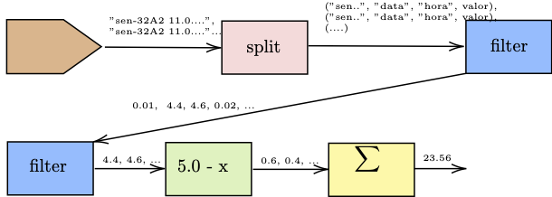
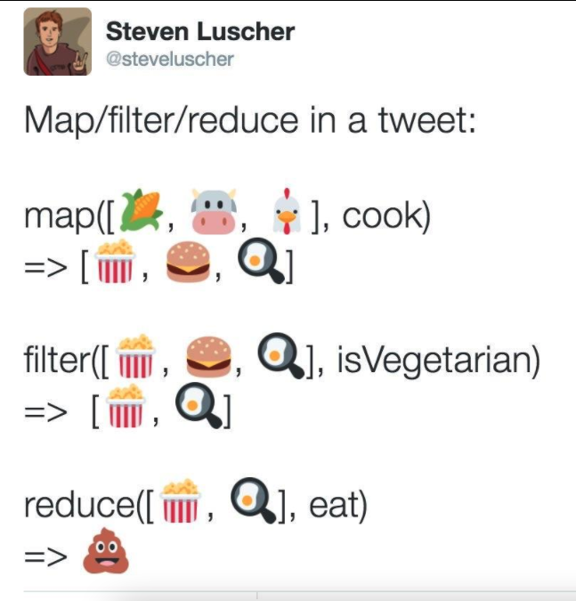
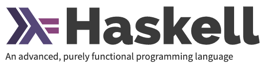
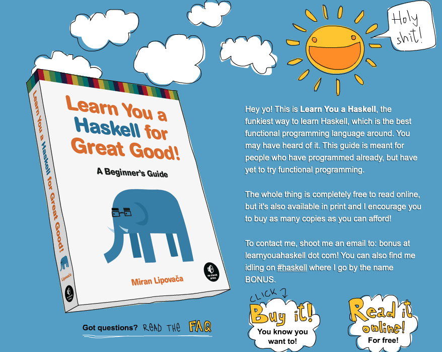
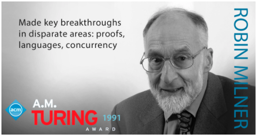

## Tópicos Avançados II (ECT 2703)
### Programação Funcional e Concorrente

--- 
Carlos Olarte

email: <carlos.olarte@gmail.com>

Horários de atendimento: quase 7 x 24 ;-)
---
# 1. Motivação
---
## Programação imperativa
O mais importante: *Variáveis e estado*

```
// Variáveis: armazenam dados de algum tipo
int idade;
float preço;
// Vetores: Coleção de variáveis do mesmo tipo
float notas[TAM];
// Tipos estruturados
struct Pessoas{
  Data DN;
  char nome[50];
  ...
};
```
---
## Programação imperativa
Controlamos a execução das instruções: 
```
  // Condicionais
if (c) {
...
}
else {
...
}

switch (n){
  case ....
}

// Laços de repetição
for (...){
 ...
}

while(...){
 ...
}

do{
  ...
} while(...);
```
---

## Programação imperativa
Chamar uma função (com os mesmos parâmetros) não necessariamente retorna o mesmo valor:

```cpp
int i=0; // Variável global

int f(){
    i++;
    return i;
}
cout << f() ; // 1
i++;
cout << f() ; // 3
```
Parece simples... mas, para entender o comportamento de `f`, devemos analisar
outras partes do código e _as suas interações_!

---
## Programação imperativa

> É um paradigma de programação que descreve a computação como *ações*  ou 
> comandos que mudam o _estado_ de um programa.

Os programas executam _passo a  passo_ as instruções

---

### Como resolvemos problemas no paradigma imperativo?

Devemos pensar em variáveis (para _representar_ a realidade)

Definimos mecanismos para modificar essas variáveis

Normalmente respondemos perguntas como:
 - Quantas vezes devo _repetir_ as mesmas instruções?
 - Quais são as __condições__ para executar uma instrução?
 - Depois de executar uma função, qual é o *estado* das variáveis? 

---

### Como resolvemos problemas...

Para resumir:

 - O _foco_ está em implementar procedimentos que *modificam o estado*
 - O estado das variáveis é fundamental durante a computação
 - A _ordem_ de execução das instruções é __muito importante__
 - O _fluxo_ do programa está determinado por _estruturas de controle_
 - A unidade principal são _instâncias_ de estruturas ou classes (ou tipos básicos)

>> Conclusão: Finalmente pensamos em *COMO* executar tarefas

---

### Problemas com essa abordagem...

Exemplo simples...

Como  calcular o maior elemento de um vetor de inteiros?

---
### Problemas com essa abordagem...

Como  calcular o maior elemento de um vetor de inteiros?

Normalmente começamos a pensar em coisas como:

>> Vou utilizar uma variável max. Comparo max com o primeiro elemento. Se for maior,
 atualizo max. Caso contrário, não faço nada. Depois repito as mesmas operações
 até o final...

 Uff!! Quanta coisa para um exemplo simples!

---
### Maior elemento (versão imperativa)

Vamos ver se da certo:

```cpp
int maior(int v[], int n){
 int max;
 for(int i=0 ;i < n ; i++){
     if (max < v[i]) 
         max = v[i];
 }
 return max;
}
```
Funciona?

---

### Maior elemento: versão declarativa

Será que podemos pensar de uma forma mais _declarativa_?

>> O maior elemento da sequência `x:L` é o maior número entre `x` e o maior elemento de `L`

Vocês em 3 semanas escreverão:
```haskell
maior l = foldl max (head l) l -- Haskell
```

```python
maior = lambda l: reduce(max, l, l[0]) # Python

#ou, também
def maior(l): return reduce(max, l, l[0])
```
;-)

---
### Reaproveitar código?
Será que podemos reaproveitar a função `maior` em C++ para implementar o somatório 
de um vetor de inteiros?

---
### Reaproveitar código?
mmmm na verdade, só copiando e colando...

```
int soma(int v[], int n){
 int s=0; // antes max=v[0];
 for(int i=0 ; i < n ; i++){
     s += v[i]; // antes if .. 
 }
 return s; // antes return max
}
```

Parece a mesma coisa...  Será que podemos _abstrair_ esse tipo de comportamento?

__Yes we can!__

---
## Reaproveitar código?
```
int soma(int v[], int n){
 int s=0; // antes max=v[0];
 for(int i=0 ; i < n;i++){
     s += v[i]; // antes if .. 
 }
 return s; // antes return max
}
```
Só precisamos modificar a inicialização e o procedimento para _acumular_ os valores. 

Vocês em 3-4 semanas:

```haskell
maior l = foldl max (head l) l
somatorio' l = foldl (+) 0 l
somatorio = foldl (+) 0
```
---
### Reaproveitar código?

Acabamos de encontrar vários conceitos que serão amplamente explorados durante o semestre:

- _Recursão_: o maior elemento de  [1,...] é o maior número  entre 1 e o maior de [...]
- _Funções de ordem superior_: o que faz esse `max` aqui `reduce(max, L)`?
- Funções _anonimas_:  `lambda x: ...`
- _Reduções_: como `foldl` (Haskell) e `reduce` (Python)

---
### Processando fluxos de dados
Considere o seguinte problema de análises de dados:

Temos uma fluxo de dados enviado por um sensor

1. Cada elemento enviado é uma string 

`("sen-32A2 11.01.2021 02:44:22 4.34532")`

2. O sensor as vezes falha: valores `<0.5` devem ser ignorados

3. Precisamos calcular a distância de cada medição com relação a `5.0`

4. E, depois,  calcular o somatório dessas distâncias. 

---
### Processando fluxos de dados

 Esse é um cenário típico onde devemos aplicar diferentes
 transformações/tratamentos a um fluxo de dados. 

 

---
### Processando fluxos de dados
Como implementar isso? 
#### Alternativa 1

```cpp
struct Dado{ char id[TAM], ...., float valor};

float proc(char [][TAM], int n){
    Dado aux[TAM], aux2[TAM];
    float dist[TAM];
    float soma=0;

    for(....) // Quebrar as strings
        aux[i++] = ....

    for(....) // Filtrar <= 0.5
        if ... aux2[j++] = ...

    for(....) // Calcular distancia
        dist[k++] = 5.0 - aux2[i];

    for(....) // Calcular somatôrio
        soma += ....

    return soma;
}
```
---
#### Alternativa 1
A função `proc` não pode ser _reaproveitada_ em outros cenários:
 - O limite 0.5 pode mudar
 - Talvez queremos calcular a maior distância e no o somatório
 - O formato de entrada pode mudar de sensor para sensor

Eficiência: 
 - Os arrays são percorridos várias vezes
 - Devemos criar (explicitamente) vários arrays auxiliares
---
#### Alternativa 1

Estrutura do código:
 - Será que precisamos criar a `struct` Dado (só para esta tarefa)?
 - Os laços `for` para quebrar a string e calcular a distância fazem coisas 
   parecidas: transformar cada um dos valores de um array. (E a gente não
   gosta de _copia e colar_ código, né?)

Será que existe uma forma mais _limpa_, _flexível_ e _eficiente_  de implementar isso?

__Yes there is!__

---
#### Alternativa 2
Filtrar elementos de uma lista/fluxo é uma tarefa corriqueira. Segue uma boa abstração:

```python
filter(lambda x: x > 0.5, l) # Python
```

```haskell
filter (>0.5) l -- Haskell
```

Alternativamente, podemos utilizar _Compreensão de Listas_
```python
list(x for x in l if x > 0.5) # Python
```

```haskell
[ x | x <- l, x > 0.5] -- Haskell
```
---
#### Alternativa 2
Gerar fluxos a partir de transformações de cada um dos elementos de um fluxo é 
também uma tarefa comum. Segue uma boa abstração:

```python
map(lambda x: 5.0 - x, l) # Python
```

```haskell
map (5.0 - ) l -- haskell
```
---
#### Alternativa 2
Acabamos de encontrar alguns outros conceitos interessantes:

- _Filtros_: Aplicar alguma condição a um fluxo
- _Maps_ : Aplicar uma função a cada um dos elementos
- _Aplicação parcial_ e _Currying_: o que significa realmente a expressão `(> 0.5)`? 
   Se `>` precisa de dois parâmetros, por que estamos utilizando só um? 
- _Avaliação preguiçosa_ (e _geradores_): A expressão em Python "`x for x in ...`"
   não retornam uma lista. Ela "promete" que uma lista vai ser gerada quando for necessário.

---
## Outras linguagens
Será que o problema é C++?

Existem muitas linguagens... e de características totalmente diferentes!


---

## Curiosidade
Como imprimir na tela "alo mundo" (hello world):

[Hello world!](http://c2.com/cgi/wiki?HelloWorldInManyProgrammingLanguages)

[Rosseta.org](http://rosettacode.org/)

---
## Outras linguagens
Será que o problema e C++?

Na verdade, *não*. 
```cpp
// map em C++
std::transform(vec.begin(), vec.end(), vec.begin(),
              [](float x){ return 5.0 - x;} );
// filter em C++
auto it = std::remove_if(vec.begin(), vec.end (),
     [](float x){return (i<= 0.5);});
```

---
### Outras linguagens
Cada vez as linguagens de programação (tipicamente imperativas) estão adicionando
conceitos funcionais. 
```python
# GUIs em Python (adicionar uma ação a um botão)
self.btnAdd.bind(" < Button > ", lambda e: ...)
```

Lambdas, filters, etc em Javascript
```javascript
// Lambda
var soma = (a, b) => a + b; 
// Filter
[1,2,3,4].filter(x => x % 2 === 0);
```
Então... _melhor aprender a utilizar bem esses recursos!_

---
### Outras linguagens
Muitas linguagens "novas", inspiradas no paradigma funcional estão aparecendo:
- Closure
- Escala
- F#
--- 
### Outras linguagens 


Ver vídeo [aqui](https://www.youtube.com/watch?v=Pmhap3acJvs)
---
## Programação Funcional
Alguns programas não precisam de _estado_
```
int fatorial(int n){
   int p=1,i;
   for(i=2;i<=n;i++)
    p*= i;

   return p;
}

// VS

int fatorial(int n){
   if (n==0)
     return 1;
   return n* fatorial(n-1);
}
```
---
#### Programação Funcional 
A definição recursiva é quase a mesma coisa que a descrição (em palavras) da função:

>> O fatorial de 0 é 1. O fatorial de n é n vezes o fatorial de n-1. 

Por que então pensar em laços de repetição e variáveis ?

Não seria melhor utilizar técnicas _declarativas_?

---
#### Programação Funcional 
> Paradigma de programação que trata a computação como uma _avaliação de funções matemáticas_ e que evita estados ou dados mutáveis

Mas C++, Javascript, Python, etc  possuem funções... que tem de especial essas funções no  paradigma funcional?

---
#### Currying (aplicação parcial)
```haskell
prod :: Int -> Int -> Int -- Haskell. 
prod x y = x * y

dobro1 :: Int -> Int
dobro1 x  = prod 2 x
dobro2 :: Int -> Int
dobro2 = prod 2 
dobro3 = (* 2) -- Whaaat? Aplicação parcial ;-)
```

```python
from functools import partial # Python
def prod(x,y): return x*y
def dobro1(x): return prod(2,x)
dobro2 = lambda x: prod(2,x)
dobro3 = partial(prod, 2)
```

_Currying_: Transformação de uma função que recebe múltiplos parâmetros  de forma que ela pode ser chamada  recebendo menos parâmetros.

--- 

#### Higher order (Funções de ordem superior)
Função para incrementar em 1 os valores de um vetor.

```C++
void inc(int v[], int n){
    for (int i=0; i < n; i ++ ) 
     v[i] += 1; 
}
```

Função para multiplicar x 2 cada elemento

```C++
void inc(int v[], int n){
    for (int i=0; i < n; i ++ ) 
    v[i] *= 2; 
}
```

Será que existe uma melhor forma de fazer isso?

---

#### As funções são cidadãos de primeira classe
- As funções podem ser _parâmetros_ de funções.
- As funções podem _retornar_ funções.

```Python [1-4|6-9|11|12|13-14]
# Código em Python
# func é uma função! 
def converter(func, lista):
    return [func(x) for x in lista]

converter(lambda x: x+1, [1,2,3])
[2, 3, 4]
converter(lambda x: x*2, [1,2,3])
[2, 4, 6]

list(map(lambda x: x+1, [1,2,3])) # [2, 3, 4]
list(filter(lambda x: x>5, [1,6,2,7])) # [6, 7]
reduce(lambda  x, y : x + y , [1,2,3]) # 6
reduce(lambda  x, y : x * y , [1,2,3]) # 6
```
---
### Programação Funcional

---
### Programação Funcional
- Pensamos em _QUE_ são as tarefas e não _COMO_ faze-las
- A ordem das instruções não é importante
- O foco está nas _expressões_ e os valores que retornam (não em comandos). 
- Utilizando _composição_ de funções descrevemos transformações mais complexas
- Não existe o estado

```haskell
-- Pensamos em... qual é o valor de fat(n)?
fat 0 = 1
fat n = n * fat (n-1)
```
---
### Programação Funcional
Código mais eficiente:
 - Expressões (puras) que não são utilizadas podem ser removidas
 - Chamar a mesma função 2 vezes produz o mesmo resultado (_Memoization_)
 - Sem dependências, podemos executar o código de forma __concorrente__.
 - É mais fácil provar que o programa é *correto*. 
 - O compilador pode escolher a (melhor) estratégia de redução.
---

### Estado e concorrência

Algumas aplicações são mais "lentas" porque precisam baixar dados da internet (ou consultar um banco de dados). 

O hardware que temos disponível normalmente inclui vários núcleos/cores

Como aproveitar essa capacidade para escrever programas mais "rápidos"?

>> Infelizmente... programas concorrentes são difíceis de escrever (_corretamente_)!

---
### Estado e concorrência

Um exemplo simples. Considere uma função `f` definida nos números inteiros. Sabemos
que existe um `x` tal que `f(x) = 0`. Como encontramos esse zero?


---
### Estado e concorrência
Considere os trechos de código:
```
// Positivos
x = 0;
while (! found){
  found = (f(x) == 0);
  x++;
}

// Negativos
y = 0;
while(! found){
    y--;
    found = (f(y) ==0);
}
```
- O programa `POS ; NEG` termina (encontrando a solução)?
- O programa `POS | NEG` termina (encontrando a solução)?

---
### Estado e concorrência

Programas com _Threads_ que compartilham estado são muito complexos

O problema é o _intercalamento_: um grande número de possíveis execuções!

---
### Estado e concorrência

Functional programming to the rescue!


Super lambda Man (Philip Wadler)

---
### Estado e concorrência
Se chamamos funções "puras" (sem efeitos colaterais / estado)...

A "paralelização" do código deveria ser mais simples!
```haskell
-- Quick sort sequencial (versão funcional)
sort :: (Ord a) => [a] -> [a]
sort [] = []
sort (x:xs) =  
  menor ++ x:maior
    where menor  = sort [y | y <- xs, y <  x]
          maior  = sort [y | y <- xs, y >= x]
```
---
### Estado e concorrência
```haskell
-- Quick sort paralelo... simples, verdade?
sortP :: (Ord a) => [a] -> [a]
sortP [] = []
sortP (x:xs) =  
  maior `par` menor `pseq` (menor ++ x:maior)
    where menor  = sortP [y | y <- xs, y <  x]
          maior  = sortP [y | y <- xs, y >= x]
```
---
### Estado e concorrência
Lembra dele na versão iterativa?
```cpp
int partition(int v[], int left, int right)
{
  int i = left, j = right;
  int tmp;
  int pivot = v[(left + right) / 2];

  while (i <= j) {
    while (v[i] < pivot)
      i++;

    while (v[j] > pivot)
      j--;

    if (i <= j) {
      swap(v,i,j);
      i++;
      j--;
    }
  }

  return i;
}

void quickSort(int v[], int left, int right) {
  int index = partition(v, left, right);
  print(v,TAM);
  if (left < index - 1)
    quickSort(v, left, index - 1);
  if (index < right)
    quickSort(v, index, right);
}
```

---
# 2. Uma disciplina... duas linguagens

   

 

 e um só paradigma... bom, quase. 
---

### Uma disciplina... duas linguagens
Por que Haskell?

- Haskell é uma linguagem funciona __pura__
- Sem estado, sem estruturas de controle (`if, for`, ...)
- Correspondência um-a-um com os conceitos que vamos ver

_Ideia_ Primeiro implementar em Haskell. Assim, você não vai ter a __tentação de
pensar de forma imperativa!__

---
### Uma disciplina... duas linguagens
Por que Haskell?

>> "Haskell is great and if you're interested in programming you should really
>> learn it even if it seems _weird at first_. Learning Haskell is much like
>> learning to program __for the first time__ — it's fun! It *forces you to think*
>> *differently*" (Miran Lipovača)

---
Falando de [Miran Lipovača](http://learnyouahaskell.com/)...


---
### Uma disciplina... duas linguagens
Por que Haskell?

>> Haskell is _elegant and concise_. Because it uses a lot of _high level_
>> concepts, Haskell programs are usually __shorter__ than their imperative
>> equivalents. And shorter programs are easier to maintain than longer ones
>> and have less bugs. (Miran Lipovača)

```haskell
primes = filterPrime [2..]
  where filterPrime (p:xs) =
          p : filterPrime [x | x <- xs, x `mod` p /= 0]
```

>> succintness: "to move fast and not break things"
---
### Uma disciplina... duas linguagens
Por que Haskell?

Cada vez grandes projetos (Google, Microsoft, New York Times, etc)  estão pensando em Haskell. Veja o projeto
[Sigma](https://engineering.fb.com/2015/06/26/security/fighting-spam-with-haskell/) 
de Facebook
 - Mais de 1.000.000 de request por segundo
 - Precisa ser _seguro e confiável_
 - Mudar fácilmente requisitos
 - Ser eficiente. 

Alguns estereótipos e preconceitos 
 - Difícil
 - Não serve para ambientes de produção

Veja o [Vídeo](https://www.youtube.com/watch?v=mlTO510zO78)
---
### Uma disciplina... duas linguagens

Functional programming has seen use in a _wide variety of industrial
applications_. For example, __Erlang__ was originally used to implement
fault-tolerant _telecommunications systems_ but has since become popular for
building a range of applications at companies such as _Nortel, Facebook,
Électricité de France and WhatsApp_. __Scheme__ has been applied to problems
such as training simulation software and telescope control. __OCaml___ has seen
commercial use in areas such as _financial analysis, driver verification,
industrial robot programming_ [...] __Haskell__ has also been applied by a range
of companies, in areas such as _aerospace systems, hardware design, and web
programming_. (Fragmento da
[Wikipedia](https://en.wikipedia.org/wiki/Functional_programming)). 

---
### Uma disciplina... duas linguagens
Por que Haskell?
- Muitas técnicas/ferramentas para verificar que o código é correto
- Puro (_transparência referencial_)
- Lazyness 
- Sistema de tipos robusto 
- Execução concorrente
- Muito eficiente

---
### Uma disciplina... duas linguagens
Falando de tipos...

>> Well-typed programs cannot "go wrong" (Robin Milner)


---
>> In 1956 I went on a course [...] I regarded programming as really rather
>> _inelegant_. You'd write one instruction after the other, and it was all
>> __rather arbitrary__. It seemed to me that programming *was not a very
>> beautiful* thing. So I resolved that I would never go near a computer in my
>> life! ([Robin Milner](http://users.sussex.ac.uk/~mfb21/interviews/milner/)) 
>> ... _No final dos 70's, Robin Milner criou ML!_


---
### Uma disciplina... duas linguagens
Por que Haskell?

>> If facebook is able to use it in production, then Haskell is no longer an
>> academic language. I would tell my boss that we can use Haskell because
>> facebook is using it:) ([veja](https://news.ycombinator.com/item?id=10885421))

Nosso "mantra": Haskell é diferente, não difícil. 

__Paciência!__ É como começar se zero ... só que melhor ;-)

---
### Uma disciplina... duas linguagens

A primeira linguagem funcional: Lisp!


---
### Uma disciplina... duas linguagens
Por que Python?

- Amplamente utilizada na industria
- __Não é uma linguagem pura__
- Muitas bibliotecas que podemos utilizar

_Idea_: Aprendendo conceitos funcionais, podemos escrever melhores (mais concisos) programas em Python

_Depois_: Vocês poderão  aplicar esses conceitos em outras linguagens como Javascript, Java, C++, etc. 

---
# Plano de Curso
---
### Objetivos
- Tornar o aluno apto a resolver problemas utilizando o paradigma funcional
- Identificar e utilizar corretamente os pilares da programação funcional
- Utilizar técnicas de programação concorrente para melhorar o desempenho de programas. 

---
### Conteúdo 

- Python básico (prog. imperativa).
- Primeiros passos em Haskell (funções, listas e tuplas)
- Listas, tuplas e conjuntos em Python
- Pattern-matching e execução preguiçosa (Haskell)
- Iteradores e geradores em Python
- Funções recursivas (Haskell)
- Funções recursivas (Python)
- Funções de ordem superior em Haskell (maps, filter, fold)
- Expressões lambda em Python
- Módulos em Haskell (exercícios)
- Set, Dict, String em Python (exercícios)

---
### Conteúdo 

- Tipos de Dados em Haskell
- Named Tuples em Python 
- Sequências infinitas em Python e `itertools`
- Exercícios utilizando fractais
- Functools e Decoradores (2 aulas)
- Sockets e streams
- Threads e concorrência 
- Programação assíncrona  (2 aulas)
- Memoria compartilhada / Exposições  (2 aulas)

---
### Avaliação
- Muitas atividades curtas durante a aula 
- Um "para casa" todas as semanas. 

Todas essas atividades valem nota!
---
### Metodologia

Estamos em outro _paradigma_ (lembre, muita calma e paciência). 

Você só vai aprender os conceitos *praticando*. 

Faça os exercícios com *cuidado* (e dedicação).

Eu espero que você entregue várias soluções para o mesmo problema (tranquilo, os exercícios são simples). 

---
### Metodologia
Por exemplo: Fatorial de n
```python
def fat(n):
    prod=1
    for i in range(2,n+1):
        prod *= i
    return prod
```
Ok: primeira versão (iterativa). Isso só é para aquecer, né?
---
### Metodologia
Por exemplo: Fatorial de n
```python
def fat(n):
    if n==0: return 1
    return n * fat2(n-1)
```

Muito melhor! Solução recursiva. Será que existe outra forma de resolver o problema?

---
### Metodologia
Por exemplo: Fatorial de n
```python
def fat(n):
    def fatrec(n,acc):
        if n==1: return acc
        return fatrec(n-1, acc*n)
    return fatrec(n,1)
```
Awoo! Agora temos recursão de cauda (não muito legal em Python)

---
### Metodologia
Por exemplo: Fatorial de n
```python
from functools import reduce
def fat(n):
    return reduce(mul, range(1,n+1),1)
```
Yahoo!  Utilizando reduções

E para impressionar ainda mais ao professor... utilizando expressões lambda!
```python
fat = lambda n: reduce(mul, range(1,n+1),1)
```

---
### Metodologia
```python
def fat():
    n,acc = 0,1
    while True:
        yield acc
        n+=1
        acc*= n
```
Whaaat? Um gerador de 0!,  1!, 2!, 3!,... 


---
### Aulas
- Encontros síncronos todas as quartas e sextas
- Sempre utilizaremos o mesmo link do Google Meet
- A aula começa às 8:55

---
### Ferramentas
Comunicação 
- [Google Meet](https://meet.google.com/)
- [Discord](https://discord.com/)

Compiladores / Ferramentas

- [Python3](https://www.python.org/)
- [Pip](https://pypi.org/project/pip/)
- [Mypy](http://mypy-lang.org/)
- [Haskell](https://www.haskell.org/)
- [Jupyter Notebook](https://jupyter.org/)

---
### Ferramentas

Editores / IDEs
- [Colab](https://colab.research.google.com/)
- [PyCharm](https://www.jetbrains.com/pt-br/pycharm/)
- [VSCode](https://code.visualstudio.com/)
- [Atom](https://atom.io/)
- [Sublime](https://www.sublimetext.com/)
- Meu favorito... [Vim](https://www.vim.org/)

---
### Ferramentas
Para enviar as tarefas
- [Gist](https://gist.github.com/) 
- [Repl](https://repl.it/)
- [Codeshare](https://codeshare.io/)
- [Github](https://github.com/)
- Dropbox
- Google Drive

---
### Referências
- [Learn You a Haskell for Great Good!](http://learnyouahaskell.com/)
- Steven F. Lott: Functional Python Programming.  Packt Publishing; 2º Edition (Abril 2018)
- John Hunt: Advanced Guide to Python 3 Programming. Springer; 1st ed. 2019
- Mark Lutz: Learning Python. O'Reilly Media; Fifth edition (July 16, 2013)

---
# Sejam Bem-vindos!
---
## Para casa No1. 
- Instalar e testar as ferramentas
- Escolher uma ferramenta para postar as tarefas (Gist, repl, dropbox, etc)
- Enviar o método escolhido (e o link necessário) pelo Discord
