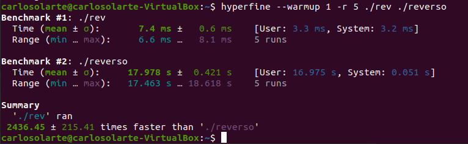

## Recursão

--- 
## Nesta aula... 

Utilizar o conceito de recursividade para definir funções. 

Entender o conceito de __recursão de cauda__

---
## Função Recursiva

Uma função _recursiva_ é uma função que se refere a _si própria_.

Utilizamos a própria função que estamos a definir na sua definição.


---
##  Ideia Geral

_Caso Base_: o resultado  é conhecido (não precisamos calcula-o).

_Caso Recursivo_: para resolver um problema de tamanho N, precisamos soluções a problemas de __tamanho M < N__

O caso recursivo tenta resolver __subproblemas__ do problema inicial. 

---
### Fatorial

- Fatorial(0) = 1 (__caso base__)
- Fatorial(n) = n * Fatorial(n-1)  (__caso recursivo__ n>0)

```haskell
-- Fatorial
fat :: (Integral a) => a -> a
fat 0    = 1
fat n    = n * fat (n - 1)
```

```haskell
-- Utilizando guardas
fat' :: (Integral a) => a -> a
fat' n
 | n == 0      =  1
 | otherwise   =  n * fat' (n - 1)
```

---
### Sequência Fibonacci

1,1,2,3,5,8,13,...

- fib(1) = 1 (_caso base_)
- fib(2) = 1 (_caso base_)
- fib(n) = fib(n-1) + fib(n-2) (_caso recursivo_)

```haskell
fib :: Int -> Int
fib 1    = 1
fib 2    = 1
fib n    = fib (n-1) + fib (n-2)
```

```haskell
fib' :: Int -> Int
fib' n
 | n == 1  || n == 2    = 1
 | otherwise            = fib' (n-1) + fib' (n-2)
```

---
### MDC - Máximo Divisor Comum 

Algoritmo de Euclides para calcular o MDC


---
### MDC - Máximo Divisor Comum 

Algoritmo de Euclides para calcular o MDC

- mdc(n,0) = n
- mdc(n,m) = mdc(m, n % m)

```haskell
-- Algoritmo de Euclides para calcular o MDC
mdc :: (Integral a) => a -> a -> a
mdc x 0     =   x
mdc x y     =   mdc y (x `mod` y)
```

---
### Maior elemento

- maior elemento da lista vazia ...  __não existe!__
- maior elemento de uma lista [x] é o próprio x
- maior elem. de x:xs é o máximo entre x e o maior elem. de xs

```haskell
maior :: (Ord a) => [a] -> a
maior []       = error "Maior não funciona com listas vazias!"
maior [x]      = x
maior (x:xs)   = max x (maior xs)
```

```haskell
-- Utilizando case .. of 
maior' :: (Ord a) => [a] -> a
maior' l =
  case l of
   []   -> error "Maior não funciona com listas vazias!"
   [x]  -> x
   x:xs -> max x (maior' xs)
```
---

### Busca Binária

Considere uma lista ordenada. 

Como podemos buscar eficientemente um elemento nessa lista?

Será que precisamos percorrer toda a lista?

---

### Busca Binária

Vamos utilizar uma função de listas.

Lembra de `take` e `drop`?

```haskell
Main> splitAt 3 [1..10]
([1,2,3],[4,5,6,7,8,9,10])
Main> splitAt 3 ["alo mundo"]
(["alo mundo"],[])
Main> splitAt 3 "alo mundo"
("alo"," mundo")
```

---
### Busca Binária

```haskell
buscar :: (Ord a) => a -> [a]  -> Bool

buscar _ []    = False
buscar n l
  | n == x      =  True
  | n < x       =  buscar n l1
  | otherwise   = buscar n l2
  where
    mid  = div (length l) 2 -- Índice do meio
    (l1, x:l2) = splitAt mid l -- Quebrar a lista em 2
```
---

### Reverso de uma lista
- O reverso da lista [] é []
- O reverso da lista  x:xs deveria ser o reverso de xs adicionando x no final

```haskell
reverso :: [a] -> [a]
reverso []       =  []
reverso (x:xs)   =  reverso xs ++ [x]
```

---
### Recursão de Cauda

Execute `fib 30` ou `fib 40`... um pouco demorado, né?

> Por cada chamada à função `fib`, precisamos de 2 chamadas extra à mesma função

E `reverso [1..1000000]`? Qual é o resultado?

> A operação __`xs ++ [x]`__ precisa percorrer toda a lista!

---
### Execução de funções

Considere o código em c++
```cpp
int f(int n){       // 1
    n = n+1         // 2
    return n;       // 3
}                   // 4

int g(int x){       // 5
    x = f(x) + 1;   // 6
    return x;       // 7
}

int main(){         // 8
    cout << g(3) ;  // 9
    return 0 ;      // 10
}
```
---
### Execução de funções

Quando a main chama `g(3)`, o _contexto de execução_ é armazenado
`Contexto: {linha 9}` e a execução __suspensa__. 

Começamos a executar `g` com `Contexto: {x: 3, linha 6}`

Na linha 6 a execução de `g`  deve ser suspensa e armazenar o contexto na pilha

A execução de `f` inicia com 
`Contexto: {n:3, linha 1}` e termina retornando 4. 

Recuperamos o ctx no topo da pilha (`g`) `Cont: {x:3, l 6}`

Próxima linha em `g`: `Contexto: {x:5, linha 7}`

A execução da main continua.

---
### Execução de funções
Quando uma função `f` chama outra função `g`:
 1. A execução de `f` é suspensa
 2. O contexto de execução de `f` é armazenado na pilha de execução
 3. Começa a execução de `g`
 4. Quando a execução de `g` terminar, o contexto de `f` é recuperado (no topo da pilha)
---

[Pythontutor](http://pythontutor.com/iframe-embed.html#code=%23include%20%3Ciostream%3E%0A%0A%0Aint%20f%28int%20n%29%7B%20%20%20%20%20%20%20%0A%20%20%20%20n%20%3D%20n%2B1%3B%20%20%20%20%20%20%20%20%20%0A%20%20%20%20return%20n%3B%20%20%20%20%20%20%20%0A%7D%20%20%20%20%20%20%20%20%20%20%20%20%20%20%20%20%20%20%20%0A%0Aint%20g%28int%20x%29%7B%20%20%20%20%20%20%20%0A%20%20%20%20x%20%3D%20f%28x%29%20%2B%201%3B%20%20%20%0A%20%20%20%20return%20x%3B%20%20%20%20%20%20%20%0A%7D%0A%0Aint%20main%28%29%7B%20%20%20%20%20%20%20%20%20%0A%20%20%20%20int%20x%20%3D%204%3B%0A%20%20%20%20std%20%3A%3A%20cout%20%3C%3C%20g%28x%29%20%3B%20%20%0A%20%20%20%20return%200%20%3B%20%20%20%20%20%20%0A%7D&codeDivHeight=400&codeDivWidth=350&cumulative=false&curInstr=11&heapPrimitives=nevernest&origin=opt-frontend.js&py=cpp&rawInputLstJSON=%5B%5D&textReferences=false")

<iframe width="800" height="500" frameborder="0" src="http://pythontutor.com/iframe-embed.html#code=%23include%20%3Ciostream%3E%0A%0A%0Aint%20f%28int%20n%29%7B%20%20%20%20%20%20%20%0A%20%20%20%20n%20%3D%20n%2B1%3B%20%20%20%20%20%20%20%20%20%0A%20%20%20%20return%20n%3B%20%20%20%20%20%20%20%0A%7D%20%20%20%20%20%20%20%20%20%20%20%20%20%20%20%20%20%20%20%0A%0Aint%20g%28int%20x%29%7B%20%20%20%20%20%20%20%0A%20%20%20%20x%20%3D%20f%28x%29%20%2B%201%3B%20%20%20%0A%20%20%20%20return%20x%3B%20%20%20%20%20%20%20%0A%7D%0A%0Aint%20main%28%29%7B%20%20%20%20%20%20%20%20%20%0A%20%20%20%20int%20x%20%3D%204%3B%0A%20%20%20%20std%20%3A%3A%20cout%20%3C%3C%20g%28x%29%20%3B%20%20%0A%20%20%20%20return%200%20%3B%20%20%20%20%20%20%0A%7D&codeDivHeight=400&codeDivWidth=350&cumulative=false&curInstr=11&heapPrimitives=nevernest&origin=opt-frontend.js&py=cpp&rawInputLstJSON=%5B%5D&textReferences=false"> </iframe>

---
### Recursão de Cauda
A ideia: a chamada recursiva deve ser a _ultima_ operação realizada. 

Isso evita armazenar os contextos na pilha. 

```haskell
fatorial :: (Integral a) => a -> a
fatorial n  = fatrec n 1
  where fatrec :: (Integral a) => a -> a -> a
        fatrec 0 resultado    =  resultado
        fatrec n resultado    =  fatrec (n-1) (resultado * n)
```
---
### Recursão de Cauda

Em Haskell, pelo modelo de execução, as vezes isso não melhora o desempenho.


- [Hyperfine](https://github.com/sharkdp/hyperfine) para benchmarks
- fat(60000): função sem utilizar recursão de cauda
- fatorial(60000): recursão da cauda

---
Exemplo em [Pythontutor](http://pythontutor.com/iframe-embed.html#code=%23include%20%3Ciostream%3E%0Ausing%20namespace%20std%3B%0A%0Aint%20fat%28int%20n%29%7B%0A%20%20if%20%28n%3D%3D0%29%0A%20%20%20%20return%201%3B%0A%20%20return%20n%20*%20fat%28n-1%29%3B%0A%7D%0A%0A%0Aint%20fatrec%28int%20n,%20int%20acc%29%7B%0A%20%20if%20%28n%3D%3D0%29%20return%20acc%3B%0A%20%20return%20fatrec%28n-1,%20acc*n%29%3B%0A%7D%0A%0Aint%20fatorial%28int%20n%29%7B%0A%20%20return%20fatrec%28n,1%29%3B%0A%7D%0A%20%20%0Aint%20main%28%29%20%7B%0A%20%20cout%20%3C%3C%20fat%284%29%20%3B%0A%20%20cout%20%3C%3C%20%20fatorial%284%29%3B%0A%20%20return%200%3B%0A%7D&codeDivHeight=400&codeDivWidth=350&cumulative=false&curInstr=0&heapPrimitives=nevernest&origin=opt-frontend.js&py=cpp&rawInputLstJSON=%5B%5D&textReferences=false) de Recursão de Cauda (sem otimização) 

<iframe width="800" height="500" frameborder="0" src="http://pythontutor.com/iframe-embed.html#code=%23include%20%3Ciostream%3E%0Ausing%20namespace%20std%3B%0A%0Aint%20fat%28int%20n%29%7B%0A%20%20if%20%28n%3D%3D0%29%0A%20%20%20%20return%201%3B%0A%20%20return%20n%20*%20fat%28n-1%29%3B%0A%7D%0A%0A%0Aint%20fatrec%28int%20n,%20int%20acc%29%7B%0A%20%20if%20%28n%3D%3D0%29%20return%20acc%3B%0A%20%20return%20fatrec%28n-1,%20acc*n%29%3B%0A%7D%0A%0Aint%20fatorial%28int%20n%29%7B%0A%20%20return%20fatrec%28n,1%29%3B%0A%7D%0A%20%20%0Aint%20main%28%29%20%7B%0A%20%20cout%20%3C%3C%20fat%284%29%20%3B%0A%20%20cout%20%3C%3C%20%20fatorial%284%29%3B%0A%20%20return%200%3B%0A%7D&codeDivHeight=400&codeDivWidth=350&cumulative=false&curInstr=0&heapPrimitives=nevernest&origin=opt-frontend.js&py=cpp&rawInputLstJSON=%5B%5D&textReferences=false"> </iframe>

---
### Recursão de Cauda
#### Exemplo Reverso

A ideia: acumular a solução e concatenar no começo:

```
rev [1,2,3,4] []  -- >
rev [2,3,4] [1]   -- >
rev [3,4] [2,1]   -- >
rev [4] [3,2,1]   -- >
rev []  [4,3,2,1] -- >
```
- Isto `a:xs` _é muito eficiente_
- Isto `xs++[a]` precisa __percorrer toda a lista `xs`__

---
### Recursão de Cauda
#### Exemplo Reverso

A ideia: acumular a solução e concatenar no começo:
```haskell
rev :: [a] -> [a]
rev l = revrec l []
 where revrec :: [a] -> [a] -> [a]
       revrec [] res     =  res
       revrec (x:xs) res =  revrec xs (x:res)
```
---
### Recursão de Cauda
#### Exemplo Reverso



- Os dois benchmarks estão calculando reverso de `[1..30000]`

---
### Recursão de Cauda
#### Exemplo fibonacci

```haskell
fibonacci :: (Integral a) => a -> a
fibonacci n   = fiborec n 1 1
  where fiborec :: (Integral a) => a -> a -> a -> a
        fiborec 1 _ ultimo      = ultimo
        fiborec 2 _ ultimo      = ultimo
        fiborec n pen ultimo    = fiborec (n-1) 
                                          ultimo 
                                          (pen + ultimo)
```

1. Recursão de cauda
2. Evitamos as 2 chamadas recursivas

---
### Recursão de Cauda
#### Exemplo fibonacci


- fib(40)
- fibonacci(40) (versão com recursão de cauda)

---
### Exemplo ZIP

Queremos definir uma função que, dadas duas lisas `l1` e `l2`, 
retorne uma lista de tuplas, assim: 

```
l1 = [1,2,3,4]
l2 = "alo"
meuzip l1 l2 == [(1,'a'),(2,'l'),(3,'o')]
```

Como definimos a função `meuzip` de forma recursiva?

---
### Exemplo ZIP

1. Se uma das duas listas é vazia, o resultado deve ser a lista vazia.
2. Se `l1 = a:l1'` e `l2=b:l2'`, então o resultado deve iniciar com `(a,b)` e o resto é uma chamada recursiva.

```haskell
meuzip :: [a] -> [b] -> [(a,b)]
meuzip [] _    =  []
meuzip _  []   =  []
meuzip (x:xs) (y:ys) = (x,y) : meuzip xs ys
```

---
### Exemplo UNZIP
Agora a operação inversa: dada uma lista de tuplas, como podemos obter uma tupla com duas listas?

```
l = [(1,'a'),(2,'l'),(3,'o')] 
meuunzip l = ([1,2,3],"alo")
```

Como definimos essa função de forma recursiva?

---
### Exemplo UNZIP

1. Se a lista é vazia, retornamos `([],[])`
2. Se `l=(x,y):l'` o resultado deve ser da forma:
```
(x:XXX, y:YYY)
```
onde `XXX` e `YYY` podem ser obtidos recursivamente.

```haskell
meuunzip :: [(a,b)] -> ([a], [b])
meuunzip [] = ([], [])
meuunzip ((e1,e2):xs) = (e1:l1 , e2:l2)
  where
    (l1, l2) = unzip xs
```
---

### Compreensão de listas

Em python:
```python
l = [1,2,3,4]
l1 = [ x + 1 for x in l]
```

Em Haskell
```haskell
l1 = [ x + 1 | x <- l ]
```
---
### Compreensão de listas

Em Python:
```python
l1 = [ x for x in range(10) if x % 2 == 0 ]
```

Em Haskell
```haskell
l1 = [ x | x <- [0..9], x `mod` 2 == 0 ]
```
---
### Mais um exemplo: Quick Sort

```
[3, 5, 1 , 8 , 0, 10, 7] 
pivô 3: 
lmenores = [1,0]
lmaiores = [5,8,10,7]
```
Assuma que recursivamente ordenamos as duas sublistas:

```
lmenores = [1,0] - > [0,1]
lmaiores = [5,8,10,7] - > [5,7,8,10]
```

A solução resulta de juntar as duas listas e o pivô!
```
l = [0,1,  3  , 5,7,8,10]
```
---
### Mais um exemplo: Quick Sort
```haskell
quicksort :: (Ord a) => [a] -> [a]
quicksort []    =    []
quicksort (x:xs) = lmenores ++ [x] ++ lmaiores
   where lmenores = quicksort [i | i<- xs, i <= x ]
         lmaiores = quicksort [i | i<- xs, i >  x ]
```

Tente escrever em C++ uma solução mais elegante que essa! ;-)

Em Python não fica tão ruim. 
```python
def quick(l):
    if l==[]: return []
    h,*t = l # Dividir a lista em cabeça e cauda
    lmenores = quick([x for x in t if x <=h])
    lmaiores = quick([x for x in t if x > h])
    return lmenores + [h] + lmaiores
```

---
### Exercícios

- Defina recursivamente a função `pow` (utilizando multiplicação)
- Defina o somatório dos elementos de uma lista utilizando recursão de cauda
- Implementar a função `elem` (para determinar se um elemento pertence a uma lista)

---
### Para casa

- Dado um valor v e um número n, gerar a lista `[v,v,...v]` (`v` repetido `n` vezes)
- Implemente a sua própria versão da função  `splitAt`
- Considere duas listas `l1` e `l2` e assuma que elas estão ordenadas. Faça uma função
que retorne uma lista ordenada a partir de `l1` e `l2`

---
### Para casa

Escreva uma função para embaralhar uma string `s1` com uma string `s2`.
Por exemplo: 

- s1 = _natal_
- s2 = __ola__
- resultado:  _n_ __o__ _a_ __l__ _t_ __a__ _a_ _l_

> Extra: Compare com uma implementação similar (recursiva e não recursiva) em Python
