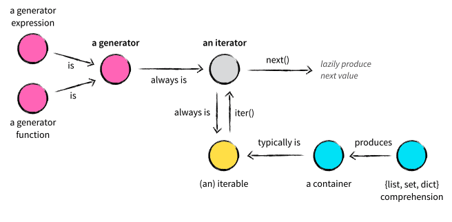

## Recursão (e mais iteradores)

--- 
## Nesta aula... 

1. Recursão em Python
2. Mais exemplos de iteradores e geradores
3. O comando `yield from`
4. Sequências infinitas

---
## Protocolo de Iteração

Todo iterador implementa uma operação básica: 

> _`next`_: para retornar o próximo elemento 

Se não tiver mais elementos, _next_ levanta uma exceção __`StopIteration`__

---
## Protocolo de Iteração

As listas, conjuntos, tuplas, etc são iteráveis. Portanto, podemos _construir um
iterador_ a partir dessas estruturas. 

```python
l = [1,2,3,4]
iterl = iter(l) # Construir um iterador a partir de l
print(next(iterl))
print(next(iterl))
print(next(iterl))
print(next(iterl))
```
---
## Protocolo de Iteração

Mais um exemplo... `range`
```python
r = range(5)
iterr = iter(r)
print(next(iterr))
print(next(iterr))
...
```

Note que podemos construir uma lista a partir de `range`

```python
l = list(range(1,9,2))
print(l) # Imprimir [1,3,5,7]
```

Só lembrando... em Haskell `[1,3 .. 7]`
---
## Compreensão de listas
Assuma que precisamos incrementar em 1 cada um dos elementos de uma lista:

A forma pythônica... utilizando _compreensão de listas_

```python
l = [1,2,3]
il1 = (x+1 for x in l)
print(next(il1))
print(next(il1))
print(next(il1))
```

Note que a expressão "__`x+1 for x in l`__" é um iterador
 
> Em palavras: "Gere" os elementos da forma `x+1` por cada x em `l`

---
## Compreensão de listas
Podemos criar listas (conjuntos, tuplas, etc) a partir de iteradores. 

```python
l1 = list(range(10))
l2 = [x for x in l1]
l3 = list(x+1 for x in range(10))
print(l1)
print(l2)
print(l3)
```

---
## Computação Preguiçosa 

Um iterador __não materializa os valores__.

Os valores são calculados só quando forem utilizados

```
from time import sleep
def incdevagar(n):
    '''retorna n+1 depois de 2 segundos'''
    sleep(2)
    print("terminei!")
    return n+1
```

---
## Computação Preguiçosa 

Um iterador não materializa os valores.
```python
it1 = (incdevagar(x) for x in [1,2,3])
```
 > `it1` tem o __"potencial"__ de gerar uma sequência... mas ainda não calculou nada

 ```python
# Só 2 segundos (para calcular o primeiro elemento)
print(next(it1)) 
```

---
## Computação Preguiçosa 
Se materializamos a estrutura, todos os elementos devem ser calculados:

```python
it1 = (incdevagar(x) for x in [1,2,3]) 
l = list(it1) # 6 segundos
print(l)
# De forma alternativa
l = [incdevagar(x) for x in [1,2,3] ] # 6 segundos
print(l)
```

---
## Compreensão de listas

Podemos utilizar compreensão de listas para _filtrar_ alguns elementos: 
```python
l = [x for x in range(100) if ehPrimo(x)]
print(f'primos: {l}')
```

---
### Geradores

Com compreensão de listas conseguimos:
 - Gerar novas sequências a partir de sequências já definidas
 - Filtrar elementos (`if...`)
 - Realizar operações por cada elemento (`[ f(x) for ...]`)

```python
l = [1,2,3]
# l2 é uma lista
l2 = list( x+1 for x in l)
print(l2) # [2, 3, 4]
# De forma alternativa
l3 = [ x+1 for x in l]
print(l3) # [2, 3, 4]
```
---
## Geradores (Expressões)

```python
>>> g = (x+1 for x in l)
>>> print(g)
< generator object < genexpr > at 0x10cc98270 >

```
> `g` é um _gerador_ e não uma lista!

---
## Geradores (Expressões)

Os geradores podem ser utilizados só uma vez!
```python
>>> l = [1,2,3]
>>> g = (x+1 for x in l)
>>> l1 = list(g)
>>> l2 = list(g) # g já foi consumido!
>>> print(l1)
[2, 3, 4]
>>> print(l2) 
[]
```
---
## Funções Geradoras

Como geramos a sequência Fibonacci?

```
1  1  2  3  5  8  13 ....
```

Parece um pouco difícil utilizando só _expressões geradoras_

---
## Funções Geradoras
O comando `yield` (em lugar de __return__)  __pausa a execução__ (_execução preguiçosa!_)

Segue uma sequência __infinita__:

```
def fibseqinf():
    '''Sequência infinita'''
    a1,a2 = 1,1
    yield a1 # Primeiro elemento
    yield a2 # segundo elemento
    while True:
        novo = a1+a2
        a1,a2 = a2, novo
        yield novo #Depois de gerar, pausa!

from itertools import islice
# Como a função "take" em Haskell
l = list(islice(fibseqinf(), 10))
print(l)
```

---
## Funções Geradoras
O comando `yield` pausa a execução (execução preguiçosa!)

Formas alternativas: 

```python
g= fibseqinf()
for i in range(10):
    print(next(g))

#Também podemos utilizar compreensão de listas!
g= fibseqinf() # Por que precisamos disto?
lfib = [ next(g) for x in range(10) ]
print(lfib)

```
> Por que instanciamos de novo `g`?

---
## Funções Geradoras
Mais uma alternativa.

- `fibseqinf` gera uma sequência infinita
- Podemos escrever uma função para "consumir" os n primeiros elementos

```python
def fibseqinfn(n):
    '''n primeiros elementos utilizando fibseqinf'''
    g = fibseqinf()
    for i in range(n):
        yield next(g)

l = list(fibseqinfn(10))
```

---
## Funções Geradoras
Mais uma alternativa:
```python
def fibnenum(n):
    '''Gerar os n primeiros termos utilizando uma enumeração'''
    for (i,x) in enumerate(fibseqinf()):
        if i>=n: break
        yield x

l = list(fibnenum(10))
```
> Note que tudo isto funciona porque os geradores são _preguiçosos_. `Enumerate`
> __não__ está enumerando todos os elementos da sequência. Ele retorna os elementos __sob demanda__!

---
## Recursão

Como esperado:

```
def fat(n:int) -> int:
    if n == 0: return 1
    return n * fat(n-1)
```
Mas o interprete de Python possui um limite na pilha de execução: 

```
print(fat(1000))

> RecursionError: maximum recursion depth exceeded in comparison
```

---
## Recursão
Infelizmente, Python não faz otimização de funções que usam _recursão de cauda_:

``` 
def fatorial(n:int) -> int:
    return fatrec(n,1)

def fatrec(n:int, res:int) -> int:
    if n == 0 : return res
    return fatrec (n-1, res * n)

print (fatorial(1000))

> RecursionError: maximum recursion depth exceeded in comparison
```

---
## Recursão

Isso significa que, _manualmente_, devemos converter as chamadas recursivas em
um laço de repetição:

```python
def fatiter(n:int) -> int:
    res = 1
    while True:
        if n == 0 : return res # Igual que em fatrec 
        n,res = n-1, n * res # fatrec(n-1, res*n)
``` 
> Claro, sempre podemos utilizar um laço `for`. 
---
## Recursão

De novo o clássico exemplo de Fibonacci:

```python
def fibrec(n:int) -> int:
    if n == 1 or n == 2 : return 1
    return fibrec(n-1) + fibrec(n-2)

print(fibrec(1000))

RecursionError: maximum recursion depth exceeded in comparison
```
Já sabemos que essa implementação tem alguns problemas:
 - Não utiliza recursão de cauda. 
 - Precisamos de 2 chamadas recursivas 

---
## Recursão

A versão utilizando recursão de cauda: 
```
def fibtail(n:int) -> int:
    return fibtailrec(n,1,1)

def fibtailrec(n:int, pult:int, ult:int) -> int:
    if n == 1 or n == 2 : return ult
    return fibtailrec(n-1,ult, pult + ult)
```

Mesmo problema: Python não otimiza `fibtailrec` e excedemos o limite da pilha. 

---
## Recursão

Convertendo manualmente a recursão em um loop:

```python
def fibtailrec(n:int, pult:int, ult:int) -> int:
    if n == 1 or n == 2 : return ult
    return fibtailrec(n-1,ult, pult + ult)

# Convertemos para...

def fibloop(n:int) -> int:
    pult, ult = 1,1
    while True:
        if n == 1 or n == 2 : return ult
        n,pult,ult = n-1, ult, pult + ult

```

> Depois utilizarmos _decoradores_ para implementar essa transformação automaticamente

---
## Recursão e iteradores

Vamos implementar uma função que, dado um iterador de inteiros, retorna o valor absoluto de cada elemento:

```
def absgen(c):
    try:
        v = next(c) # Próximo elemento 
        yield abs(v) # Gerar um valor
        yield from absgen(c) # Continuar gerando 
    except StopIteration: # Fim da sequência 
        return

it = iter([-4,-2,1,4,-6])
print(list(absgen(it)))
```
Lembre que `next(c)` consome um elemento 

_`yield from`_: continuar gerando a partir de ...

---
## Recursão e iteradores
Mas temos o mesmo problema do limite da pilha.  Solução:  laços.

```
def absgenloop(c):
    try:
        while True:
            v = next(c) # Próximo elemento
            yield abs(v) # Gerar um valor

    except StopIteration: # Fim da sequência
        return

it = iter([-4,-2,1,4,-6])
it2 = iter(range(0,-1000,-1))
print(list(absgen(it)))
print(list(absgenloop(it2)))
```
> Mas não precisamos de tudo isso!

---
## Recursão e iteradores

Lembrando que o laço _for_ é o mecanismo padrão para consumir elementos de um gerador:

```python
def absfor(c):
    for x in c: # por cada x na sequência c
        yield abs(x)
```

> Mas pode ser ainda mais fácil!

---
## Recursão e iteradores
Podemos retornar diretamente uma expressão geradora: 

``` python
def absexpgen(c):
    return (abs(x) for x in c)
```

De fato, para uma operação tão simples, melhor utilizar compreensão de listas:

```
print( [ abs(x) for x in range(0,-1000,-1) ] )
print( list( abs(x) for x in range(0,-1000,-1) ))
```

---
## Exemplo: Agrupar

Dada uma sequência, precisamos "agrupar" os elementos em pares (dois a dois):

```
1,2,3,4,5,6,... --> (1,2), (3,4), (5,6)...
```

1. Consumimos um elemento `e1`
2. Consumimos um segundo elemento `e2`
3. Geramos a tupla `(e1,e2)`

---
## Exemplo: Agrupar

Dada uma sequência, precisamos "agrupar" os elementos em pares (dois a dois):

```
def agrupar(c):
    while True:
        try:
            e1 = next(c)
            e2 = next(c)
            yield e1,e2
        except StopIteration:
            return

it = iter(range(1,11))
print(list(agrupar(it)))
```

Vocês em 2 semanas... só uma linha!
```
print(list(zip(it, it)))
```

---
## Exemplo: Zip

Dadas duas sequências, gerar uma sequência de pares ordenados: 
```
meuzip([1,2,3],["a","b","c"]) -- >   
[ (1,"a"), (2,"b"), (3,"c") ]
```

1. Extrair um elemento da primeira sequência (e1)
2. Extrair um elemento da segunda sequência (e2)
3. Gerar a tupla (e1, e2)

---
## Exemplo: Zip

```python
def meuzip(c1, c2):
    while True:
        try:
            e1,e2 = next(c1), next(c2)
            yield e1, e2
        except StopIteration:
            return

it = iter(range(10))
it2 = iter("alo mundo")

print(list(meuzip(it, it2)))
# [(0, 'a'), (1, 'l'), (2, 'o'), (3, ' ')...
```

---
## Exemplo: sequência infinita

Vamos gerar a sequência infinita 1,2,3,...

```
def seqinf():
    i = 1
    while True:
        yield i
        i+=1
```
---
## Exemplo: sequência infinita
Claramente, só podemos manipular uma subsequência finita dessa sequência

```
# Como a função take de Haskell (ou islice de Python)
def primeiros(n, seq):
    '''n primeiros elementos de seq'''
    for i in range(n):
        try:
            v = next(seq)
            yield v
        except StopIteration:
            break

print(list(primeiros(10, seqinf())))

```
---
## Exemplo: sequência infinita
Uma alternativa

```python
def primeirosv2(n, seq):
    for (i,x) in enumerate(seq):
        if i>=n: break
        yield x

print(list(primeiros(5, seqinf())))
```
---
### Iteradores vs Iteráveis 



Fonte: [Vincent Driessen, Iterables vs. Iterators vs. Generators](https://nvie.com/posts/iterators-vs-generators/)

---
### Laços `for` e Iteráveis

```python
l = [1, 2, 3]
for x in l:
    print(x)
```

É traduzido para: 
```python
l = [1, 2, 3]
it = iter(l) # Criar um iterador 
while True:
    try:
        x = next(it) # Extrair elementos do iterador
    except StopIteration:
        break
    print(x)
```
---
### Simplificando algumas funções. 
Lembre:
 - Todo _iterador_ é um __iterável__
 - Os iteradores possuem um método `next()`
 - Os __iteráveis__ possuem um método `iter()` para retornar um __iterador__
 - Os iteradores também implementam o método `iter()` (retornando uma referência a si próprio). 

Portanto, uma função do tipo
```python
def f(s : Iterable) ...
```

é mais "geral" que uma função do tipo: 
```python
def f(s : Iterator) ...
```
---
### Iteradores vs Iteráveis 

```python
from typing import Iterable, Iterator

# Uma função geradora, quando chamada, cria um iterador
def contar(n:int) -> Iterator: #Também, Iterator[int]
    for i in range(n):
        yield i

# Como todo iterador, podemos utilizar next
it = contar(4)
print(next(it))
```
---
### Iteradores vs Iteráveis 

```python
# Uma lista é um iterável, e podemos construir 
# um iterador utilizando iter
l = [1,2,3]
it = iter(l)
print(next(it))

# Mas os iteráveis não possuem método next
#print(l.next())  Erro!!
```
---
### Iteradores vs Iteráveis 
```python
# A função a seguir trabalha com iteráveis  (como parâmetro)
def maisUm(s:Iterable[int]) -> Iterator[int]:
    # Note que next não é explicitamente utilizando
    # Mas, já sabemos que o laço for cria um iterador
    for x in s:
        yield x+1

# Note que maisUm funciona com qualquer iterável
# Como todo iterador é um iterável, 
# a função também trabalha com iteradores

print(list(maisUm(range(4)))) # Range é  um iterável
print(list(maisUm([1,2,3]))) # Funciona com listas (que são iteráveis)
print(list(maisUm((1,2,3)))) # Também com tuplas
print(list(maisUm(contar(4)))) # Também com iteradores

# As expressões geradoras são iteradores. 
# Portanto, maisUm funciona
print(list(maisUm( x for x in range(10)))) # Utilizando uma expressão geradora
expgen = (x for x in range(5)) # Expressão geradora
print(list(maisUm(expgen)))
```
---
### Iteradores vs Iteráveis 

```python
# A função a seguir utiliza explicitamente "next". 
# Portanto, só podemos utilizar iteradores 
# (e não iteráveis) como parâmetros.

def meuzip(c1:Iterator, c2:Iterator) -> Iterator:
    while True:
        try:
            e1,e2 = next(c1), next(c2)
            yield e1, e2
        except StopIteration:
            return

#Erro! As listas não implementam o método next
#print(meuzip([1,2,3],[4,5,6]))

# Antes de chamar a função, 
# devemos gerar um iterador a partir do iterável
print(meuzip(iter([1,2,3]),iter([4,5,6])))
```
---
### Iteradores vs Iteráveis 
Melhor generalizar! 

```python
def meuzip2(c1:Iterable, c2:Iterable) -> Iterator:
    it1 = iter(c1) # Criando os iteradores a partir dos iteráveis
    it2 = iter(c2)
    while True:
        try:
            e1,e2 = next(it1), next(it2)
            yield e1, e2
        except StopIteration:
            return

# meuzip2 funciona com listas, tuplas e iteradores

print(list(meuzip2([1,2,3], range(3))))
print(list(meuzip2(contar(4), (1,2,3,4))))

```
---

## Para Casa

1. Generalize a função `agrupar` para que, dado um número n, a função gere listas (e não tuplas) de tamanho n:

```
print(list(agrupar(range(10),3)))
#[[0, 1, 2], [3, 4, 5], [6, 7, 8]]
```

Faça uma versão utilizando `for` e outra utilizando um laço `while`
---
## Para Casa

2. Faça uma função que, dada uma lista de listas, gere todos os elementos da estrutura:
```
[[1,2,3],[4,5],[],[6,7]] --> 1,2,3,4,5,6,7
```

Será que podemos implementar essa funcionalidade só utilizando compreensão de listas?
---
## Para Casa

3. Implemente uma função que, dada uma lista de pares ordenados, retorne um par ordenado com as duas listas:
```
[(1,2),(3,4)...] --> ( [1,3,...] , [2,4,...])
```

Note que os parâmetros são listas (e não iteradores). Tente solucionar o exercício utilizando compreensão de listas
---
## Para Casa

4. Faça uma função que gere  os elementos nas posições pares de uma sequência. Escreva uma
   solução utilizando um laço `for` e outra utilizando um laço `while`.  Será que podemos 
   escrever a mesma função utilizando `enumerate` e compreensão de listas?

---
### Para Casa

5. Vamos gerar a sequência (infinita) `1,2,2,3,3,3,4,4,4,4,...` assim:

- Defina uma função que, dado um número n, gere a sequência infinita n,n,n,n,...

- Utilizando a função `primeiros` e a função anterior, crie uma função que, dado um número n, retorne uma _lista_ com n vezes o número n
- Utilizando a função `seqinf`, a função anterior, e o para casa 2,   defina a função que gera a sequência acima. 

Será que precismos criar/materializar uma lista no passo No 3?
---
### Para Casa

> _Parabéns!_, você acaba de utilizar programação funcional! Sequências infinitas não são um problema (avaliação preguiçosa) e 
> resolvemos um problema a partir da __composição__ de funções mais simples! 

__Spoiler Alter!__

No próximo slide, a solução à questão No 5 que vocês implementarão em 2 semanas. 

---
### Para Casa

```python
def seqRepete() -> Iterator:
 return flatten( map(lambda x: islice(repeat(x), x), count(1)))

```

```haskell
seqrep :: [Int]
seqrep = concat $ map (\i -> take i (repeat i)) [1 .. ]
```

