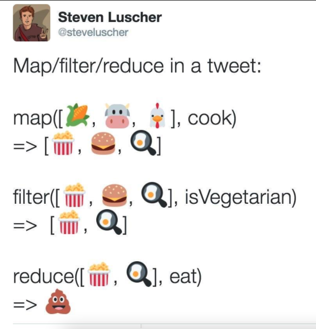

## Funções de Ordem Superior

--- 
## Nesta aula... 

- Funções de ordem superior 
- Funções `map`, `filter` e `takeWhile`
- Seções 
- Funções anônimas 

---
## Tipos e Funções

Lembre que as funções em Haskell, oficialmente, recebem __só um parâmetro__: 

```haskell
soma :: Int -> Int -> Int
soma x y = x + y

inc' :: Int -> Int
inc' x  = soma 1 x

-- "soma 1" é uma função que ainda espera por um parâmetro
inc :: Int -> Int
inc = soma 1
```
---
## Tipos e Funções

O operador `->` é associativo a direita. Portanto, o tipo
```haskell
Int -> Int -> Int
```

é igual a 
```haskell
Int -> (Int -> Int)
```

> Depois de receber um `Int`,  retorna uma função `Int -> Int`
---
## Tipos e Funções

A aplicação de funções é associativa a esquerda:

```haskell
Main> soma 3 5 == (soma 3) 5
True
```

Note que `(soma 3)` é uma função que espera por um parâmetro. 

---
## Seções 

Utilizando essa ideia, podemos utilizar __seções__ de operadores. 

```haskell
ehZero :: Int -> Bool
ehZero = (==0)

ehZero' :: Int -> Bool
ehZero' x = x == 0
```

Note que `(==0)` é uma função que espera por um argumento. 

---
## Seções 

Mais um exemplo: 

```haskell
mod2 :: Int -> Int
mod2 = (`mod` 2)

ehPar :: Int -> Bool
ehPar x  = ehZero (mod2 x)

ehMaiuscula :: Char -> Bool
ehMaiuscula = (`elem` ['A'..'Z'])

ehMaiuscula' :: Char -> Bool
ehMaiuscula' c  = (c `elem` ['A'..'Z'])

```
---
## Funções de ordem superior

Já sabemos que os tipos a seguir são iguais:
 1. `a -> a -> a`
 2. `a -> (a -> a)`

O que significa o tipo `(a -> a) -> a -> a`?

> Seja `f :: (a -> a) -> a -> a`. Então, `f` recebe: 
> 1. uma _função_ do tipo `a -> a` 
> 2. um valor do tipo `a` 

> para _retornar_ um valor do tipo `a`

---
## Funções de ordem superior

A seguir uma função que aplica duas vezes uma função (que recebe como parâmetro):

```haskell
aplicar2 :: ( a -> a) -> a -> a
-- aplicar2 recebe :
--  - uma função f do tipo a -> a
--  - um valor n do tipo a
--  -- retorna f( f a)

aplicar2 f x = f( f x)

-- Por exemplo, plus2 pode ser definida como 
-- aplicar duas vezes a função inc
plus2 :: Int -> Int
plus2 = aplicar2 inc

plus2' :: Int -> Int
plus2' x = aplicar2 inc x

plus2'' :: Int -> Int
plus2' x = inc (inc x)
```

---
## Funções de ordem superior

```haskell
Main> aplicar2 (+3) 5
11
Main> aplicar2 (++ "!") "alo"
"alo!!"
```


---
## Maps e Filter

Finalmente vamos a entender os emojis!



---
## Maps

Primeiro o tipo da função `map`:

```haskell
map :: (a -> b) -> [a] -> [b]
```

Dada uma função `f :: a -> b` que transforma _um `a` em um `b`_,
`map` transforma uma __lista de `a's` em uma lista de `b's`!__

Lembre que `show :: Show a => a -> String`

```haskell
*Main> map show [1,2,3,4]
["1","2","3","4"]
*Main> map ehZero [0,1,2,3,4]
[True,False,False,False,False]
*Main> map (/2) [ 1,2,3,4,5]
[0.5,1.0,1.5,2.0,2.5]
```

---
## Maps

Note que isso também pode ser feito com compreensão de listas:

```haskell
map (+5) [1,2,3,4] == [x + 5 | x <- [1,2,3,4]]
```

---
## Filtros

A função `filter` está definida assim:

```haskell
filter :: (a -> Bool) -> [a] -> [a]
filter _ [] = []
filter p (x:xs)
    | p x       = x : filter p xs
    | otherwise = filter p xs
```

O que faz essa função?

---
## Filtros

> Dado um predicado `P` (uma função retornando True/False),  `filter` retorna os elementos da lista que satisfazem `P`

```haskell
*Main> filter ehPar [1,2,3,4,5]
[2,4]
*Main> filter (/=4) [1,3,5,3,4,2,4,2,1]
[1,3,5,3,2,2,1]
```
---
## Filtros

Compreensão de listas também podem ser utilizadas para filtrar:

```haskell
filter (/=4) [1,3,5,3,4,2,4,2,1] == 
[ x | x <- [1,3,5,3,4,2,4,2,1], x /= 4]
```

---
## Exemplo Quicksort

```haskell
quicksort :: (Ord a) => [a] -> [a]
quicksort [] = []
quicksort (x:xs) =
    menor ++ [x] ++ maior
    where
        menor = quicksort (filter (<=x) xs)
        maior = quicksort (filter (>x) xs)
```
---
## Outra forma de pensar! 

Considere uma função que determina se um número é primo

```haskell
ehPrimo :: Int -> Bool
ehPrimo n
 | n < 2     = False
 | otherwise = [n] == [x | x <- [2..n], n `mod` x == 0]
```

Como geramos a sequência de *todos* os números primos?

```haskell
seqPrimos :: [Int]
seqPrimos = filter ehPrimo [1..]
```

---
## Outra forma de pensar! 

Como geramos os primos em um intervalo?

```haskell
primoIntervalo :: Int -> Int -> [Int]
primoIntervalo x y = filter ehPrimo [x..y]
```

Qual será o maior primo menor que 30000?

```haskell
primoMenor30000 :: Int
primoMenor30000 = head (filter ehPrimo [30000,29999 .. ])
```

Quantos primos contem uma lista?
```haskell
quantosPrimos :: [Int] -> Int
quantosPrimos l = length (filter ehPrimo l)
```

---
### Mais uma função de ordem superior

`takeWhile :: (a -> Bool) -> [a] -> [a]`

> `takeWhile P l`: Retorna os primeiros elementos de `l` que satisfazem o predicado `P`

```haskell
*Main> takeWhile (/=' ') "alo mundo"
"alo"
```

Como retornar todos os primos menores que um número n?

```haskell
primosMenores :: Int -> [Int]
primosMenores n = takeWhile (<= n) seqPrimos
```

---
## Lambdas 

São funções __anônimas__ (normalmente utilizadas só uma vez). 

São funções simples que utilizamos com outras funções de ordem superior

Por exemplo:
```
f = \l -> not (null l)
```

> `f` recebe  uma lista e retorna `True` se a lista não é vazia 

```haskell
*Main> filter (\l -> not (null l)) [ [1,2],[], [3,4],[],[],[5,6]] 
[[1,2],[3,4],[5,6]]
```

---
## Lambdas 

Note que 
```haskell
map (+3) [1,2,3,4]
```

é equivalente a 

```haskell
map (\x -> x+3) [1,2,3,4]
```

---
## Lambdas 
```haskell
filter (\x -> ehPar x) [1,2,3,4]
```

é equivalente a 
```haskell
filter ehPar [1,2,3,4]
```
---
## Exercícios

Teste o comando 
```haskell
[ (x,y) | x <- [1 .. 3] , y <- [1..3]]
```

Como calculamos a lista de tuplas (x,y,z) que formam triângulos retângulos?
Implemente uma versão utilizando a função `filter` e outra utilizando compreensão de listas. 

---
## Exercícios

Implemente a função `dividir` que, dado um predicado P e uma lista l , retorna uma tupla (l1,l2)
onde todos os elementos de l1 satisfazem P e os elementos de l2 não satisfazem P

---
## Exercícios

Implemente uma função para realizar a transformação a seguir: 
```haskell
[1,2,3,2] -->
[ [1],[2,2],[3,3,3],[2,2]]
```

---
## Exercícios

Defina uma função do tipo: 
```haskell
swap :: (a -> b -> c) -> (b -> a -> c)
```
Note que esta função "inverte" a ordem dos parâmetros. 

Por tanto, isto aqui deveria retornar True:

```haskell
restainv = swap (-)
(restainv 3 2 == 3 `restainv` 2) && (restainv 3 2 == 2 - 3)
```
