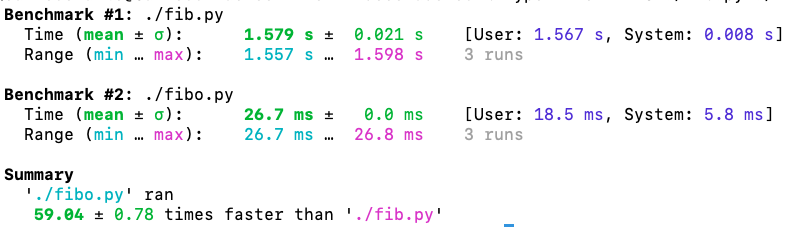

# Decoradores

--- 
### Nesta aula... 

- Closures 
- `args` e `kargs`
- Definição e uso de decoradores
---
### Funções: Cidadãos de Primeira Classe

Já vimos vários exemplos de funções de ordem superior:
- `map`
- `reduce`
- `sorted` (parâmetro `key`)

---
### Funções: cidadãos de primeira classe
As funções são objetos (que podem ser __chamados__ / __callable__)

```python
def f():
  return 1
```

```python
>>> f
< function f at 0x104a7c4c0 >
>>> g = f
>>> g
< function f at 0x104a7c4c0 >
>>> g()
1
```

Será que as funções podem _retornar_ outras  funções?

---
### Retornando uma função

Considere a função a seguir:

```python
def fun():
    def funinterna(): # Uma função aninhada
        print("alo")

    return funinterna # retorna uma referência a funinterna
```

```python
f = fun() # fun retorna uma função
f() # Chamado à função (imprime alo)
print(f.__name__) # imprime funinterna
```
---
### Funções aninhadas
```python
f = fun() # fun retorna uma função
f() # Chamado à função
print(f.__name__) # imprime funinterna
```

Note que
- `fun` _retorna_ uma função
- Qual função?... `funinterna`
- `funinterna` é conhecida como uma _função aninhada_ (definida dentro de `fun`)

---
### Funções aninhadas
Mais um exemplo: 

```python
def imprimir():
    def imp(m):
        print (m)

    msg = "alo"
    imp(msg)

imprimir()
```

- `imp` é uma função _aninhada_
- `imprimir` não retorna nada (`None`)

---
### Funções aninhadas
- `imp` é uma função _aninhada_
- A sua definição é __local__: só existe dentro de `imprimir` (__escopo__)
- Quando a função terminar a execução, as variáveis locais deixam de existir. 
- Utilizamos `return` para que o conteúdo de uma variável local seja _visível_ fora da função. 

---
### Variáveis locais

Considere o código:
```python
def incn(n):
    def f(x):
        return x+n # Note que n está definida "fora" de f
    return f

inc1 = incn(1)
inc2 = incn(2)
print(inc1(5)) #6
print(inc2(5)) #7
```

O valor de `n` deve ser "armazenado" de alguma forma para que `inc1` possa trabalhar. 

---
## Closures

Um _closure_ é uma função interna (_aninhada_) estendida com as suas 
variáveis não-locais (livres)

> Um _closure_ armazena então os valores das variáveis que estão 
definidas na função externa (onde a função interna foi definida). 

---
### Closures
Mais um exemplo: 
```python
def fexterna(x):
    y = 2
    def finterna():
        z = 3
        print(f'Variável local z: {z}')
        print(f'Variável não-local x: {x}')
        print(f'Variável não-local y: {y}')

    return finterna
```

```python
f = fexterna(1)
f()

#Variável local z: 3
#Variável não-local x: 1
#Variável não-local y: 2
```

---
### Closures

De fato, podemos listar as variáveis livres:
```python
f = fexterna(1)
f.__code__.co_freevars
>>> ('x', 'y')    
f.__closure__[0].cell_contents
>>> 1
f.__closure__[1].cell_contents
>>> 2
```

---
### Composição de Funções
Mais um exemplo: composição de duas funções (`f(g(x))`)

```python
def compor(f,g):
    '''Por enquanto, f e g são funções que
       recebem um único valor e retornam um valor'''
    def c(x):
        return f(g(x))

    return c 

def inc(x): return x+1
inc3 = compor(inc, compor(inc, inc))
print(inc3(5)) # 8
```

---
## Decoradores

Suponha que temos várias funções que retornam uma string
```python
def f1():
    return "Olá"

def f2(x):
    return x + "!"

def f3(x,y):
    return x+" " + y

def f4(s, nome):
    if (s == 'f' or s == 'F'):
        return "Sra. " + nome
    else:
        return "Sr. " + nome
```
---
## Decoradores
Mas agora precisamos que todas elas retornem as mensagens em maiúscula. 

- Sempre podemos ir função por função adicionando `.upper()`
- Note que em `f4` precisamos mudar os 2 `return`
- Será que existe uma forma mais simples?

---
### Decoradores

Podemos criar uma nova versão da função assim:

```python
def maiuscula(f):
    def m(x):
        return f(x).upper()
    return m

f2M = maiuscula(f2)
print(f2M("carlos"))
```

Mas isso não funciona para `f3` e `f4` que recebem 2 parâmetros. 

---
### Decoradores
A solução é simples... _desempacotamento de tuplas!_

```
def maiuscula2(f):
    def m(*arg):
        return f(*arg).upper()
    return m

f1M = maiuscula2(f1)
print(f1M())  # sem parâmetros
f4M = maiuscula2(f4)
print(f4M('M', "carlos"))  # 2 parâmetros 
```

---
### Decoradores
Mas inda não parece muito pythônico:
- Definimos a função original
- Criamos uma segunda versão da função
- No final temos 2 funções (e podemos escolher a função errada)

> Solução: `envolver` a função utilizando um _decorador_

> Um _decorador_ envolve uma função e _retorna outra função_ (com uma __funcionalidade estendida__). 

---
### Decoradores
```python
def caixaalta(f):
    ''' Transforma a saída (string) de f para maiúscula'''
    def caixaaltaint(*args):
        return f(*args).upper()

    return caixaaltaint
```

Notação de decorador: 
```python
@caixaalta
def cumprimentar(s, nome):
    if (s == 'f' or s == 'F'):
        return "Bom dia, Sra. " + nome
    else:
        return "Bom dia, Sr. " + nome

print(cumprimentar("F","maria")) # BOM DIA, SRA. MARIA
```

---
### Decoradores com parâmetros

Um exemplo de decoradores com parâmetros

```python
def formatar(tipo):
    '''tipo = 'M' (para maiúscula), 'm' (para minúscula) e 't'( para títulos)'''
    ftrans = str.upper
    if tipo == 'm': ftrans = str.lower
    elif tipo == 't': ftrans = str.title

    def interna(f):
        def form(*arg):
            return ftrans(f(*arg))
        return form

    return interna
```

> Note que `interna` depende do valor de `ftrans` (que, por sua vez,  depende de `tipo`)

---
### Decoradores com parâmetros

Um exemplo de decoradores com parâmetros

```python
def formatar(tipo):
 ...

@formatar('t')
def cumprimentar2(s, nome):
    if (s == 'f' or s == 'F'):
        return "bom dia, sra. " + nome
    else:
        return "bom dia, sr. " + nome

print(cumprimentar2("f","maria")) # Bom Dia, Sra. Maria
```
Como funciona tudo isso?

---
### Decoradores com parâmetros

Vamos analisar esse código.  Primeiro, sem parâmetros
```python
@decorador
def f(x,y)
    pass
```

__Significa__:
```python
f = decorador(f)
```
- `f` é a definição depois de ser _decorada_ 
- a função  `f` original (sem o decorador) não existe mais
- Pense em  `x = x+1`
- Note que `decorador` é uma função __cuja entrada é uma função e cuja saída é uma função__
---
### Decoradores

Agora um decorador com parâmetros
```python
@decorador(z)
def f(x,y):
 pass
```
__Significa__:
```python
f = decorador(z)(f)
```
- `decorador(z)`: recebe um char e retorna uma função (por exemplo, `FINT`)
- `FINT` é uma função que recebe uma função e retorna uma função
- Pense que `FINT` é um decorador sem parâmetros!
- `FINT` é a instância do `decorador` com valor `z`
---

### Aplicações de decoradores

 Já sabemos que isto aqui não é muito eficiente:
```python
def fib(n):
    if n <= 2: return 1
    return fib(n-1) + fib(n-2)
```
E se conseguirmos armazenar os valores para não recalculá-los?

---
### Aplicações de decoradores

A função `memoiza` armazena os valores já calculados em um dicionário:

```python
def memoize(f):
    dados = {}
    def fint(x):
        if x not in dados:
            dados[x] = f(x)
        return dados[x]

    return fint
```

---
### Aplicações de decoradores

Segue uma função (recursiva) muito mais eficiente:

```python
@memoize
def fibonaci(n):
    if n <= 2: return 1
    return fibonaci(n-1) + fibonaci(n-2)

```



Esse decorador já existe! <a href="https://docs.python.org/3/library/functools.html">functools.cache</a>
---
### Parâmetros em Python

Segue um exemplo de desempacotamento de um dicionário:

```python
def fpessoa(cpf, nome):
    print(f'CPF={cpf}. Nome={nome}')

d = {'nome': 'carlos', 'cpf': '111'}
fpessoa(**d)
# Se os parâmetros são nomeados, a ordem é irrelvante
fpessoa(nome="xxx",cpf="111")

```

---
### Parâmetros em Python
Parâmetros _posicionais_ vs _nomeados_

```python
def temp(*args, **kargs):
    print("Parâmetros posicionais")
    for a in args:
        print(a)

    print("Parâmetros Nomeados")
    for k,v in kargs.items():
        print(k,v)

temp(1,2,nome="carlos", cpf="111")
```

```python
#Parâmetros posicionais
#1
#2
#Parâmetros Nomeados
#nome carlos
#cpf 111
```

---
### Args e Kargs

Uma versão um pouco mais geral de um decorador:

```python
def deco(f):
    def g(*args, **kwargs):
        # Algumas ações 
        return f(*args, **kwargs)
    return g
```
---
### Exercício

Considere o problema de deixar um registro em um log com todas as vezes que
uma função  for utilizada. Por exemplo:

```
=============
inicio: inc
05/04/2021 08:43:30

============
fim: inc
05/04/2021 08:43:31
```

Isso significa que a função `inc` foi chamada às 08:43:40 e terminou
a sua execução às 08:41:31

---
### Exercício

Crie a infraestrutura necessárias para que esses logs sejam gerados e armazenados em um arquivo `log.log`

Dica: Se `f` é uma função, `f.__nome__` retorna seu nome (como string). 

Como modificamos o decorador para que aceite o nome do arquivo log a ser utilizado?
